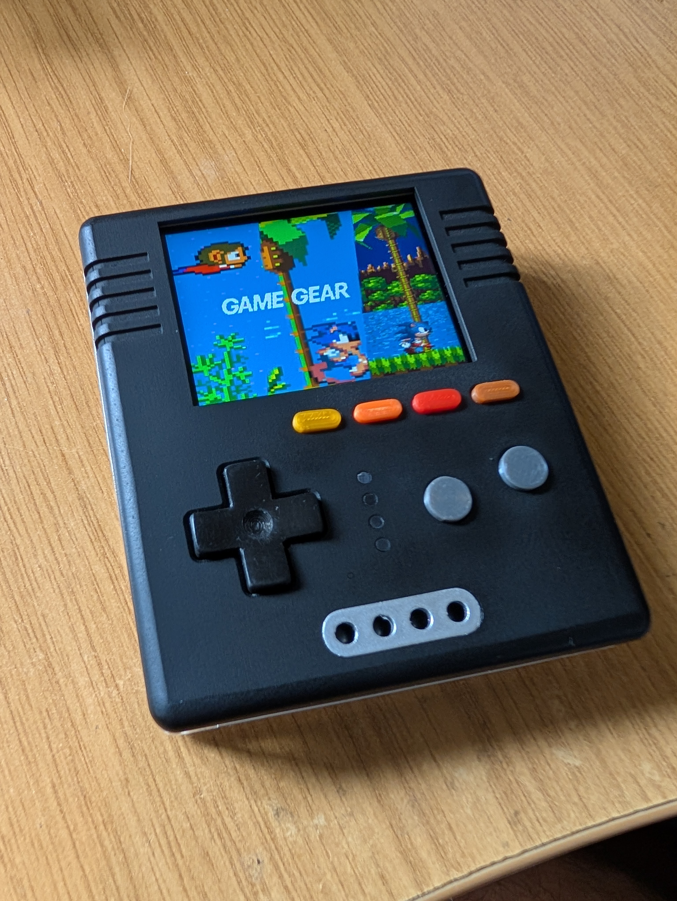

# 'IceQueen' by bphermansson (https://github.com/bphermansson)
- Status: In progress
- Ref: https://github.com/bphermansson/retro-go

# Hardware info
- ESP32-S3 N16R8 (16MB flash + 8MB PSRAM), ESP32-S3-WROOM-1.
- 2" 320x240 ST7789 display.
- SD-card reader. 

# Images
 wrong picture!
